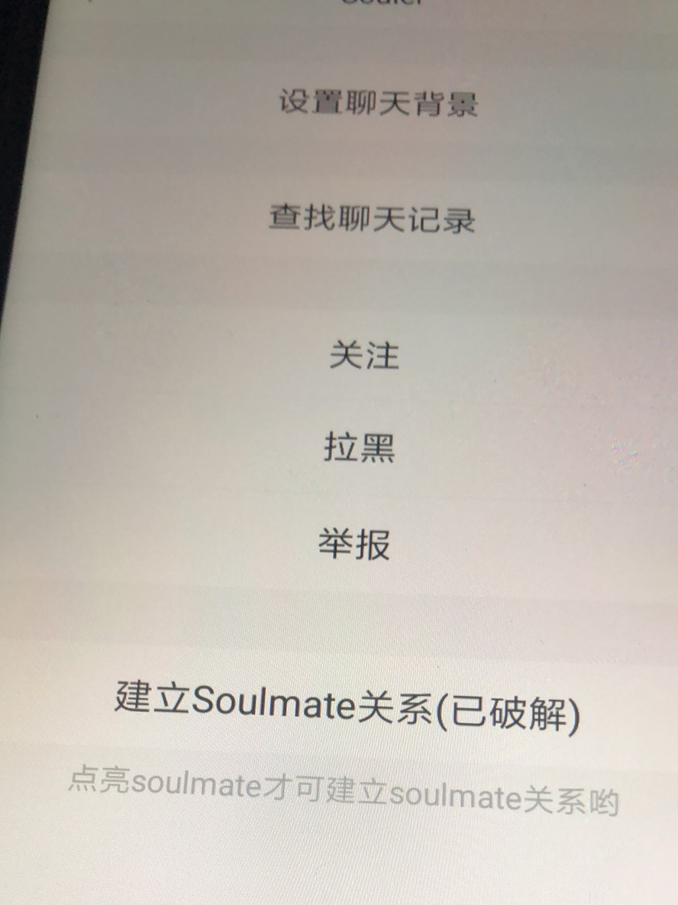
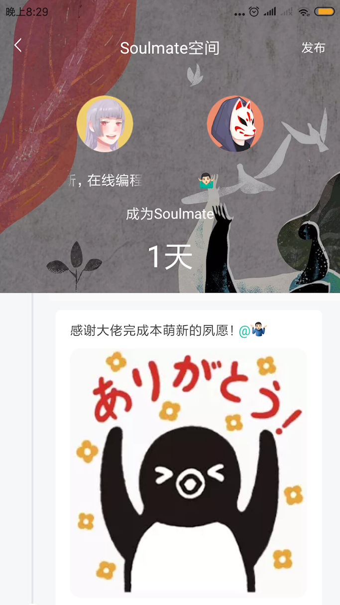
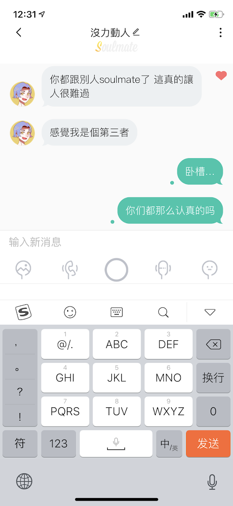
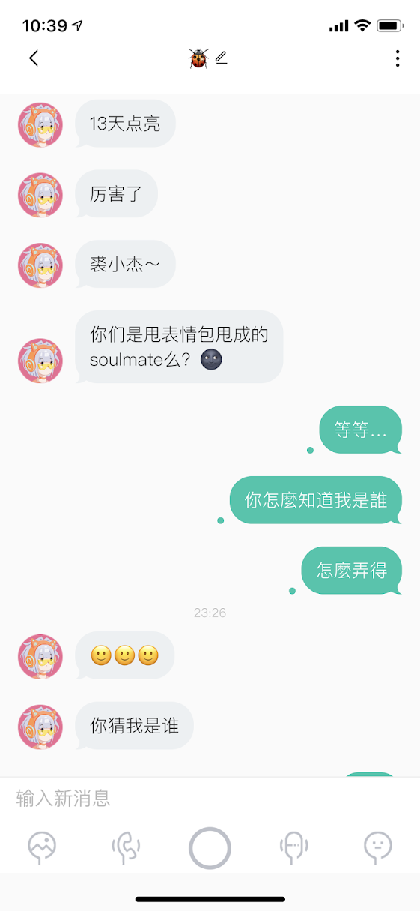
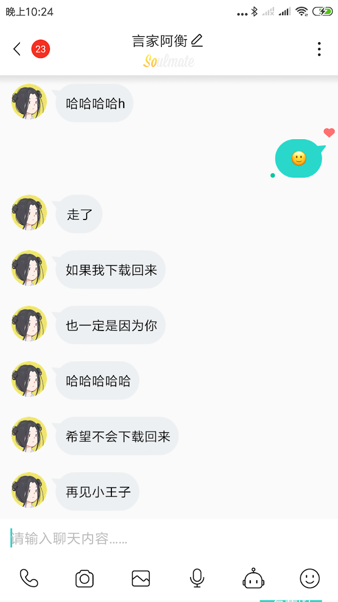
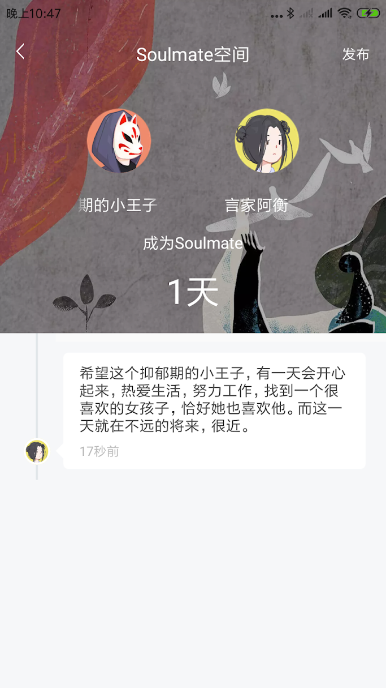

# 公开原因

20201228 公开本人18年自用，从未外传的SoulApp助手代码。

2年前未完全商业发展期间soul陪伴本人走过了挺多有意思的时光，认识了一些积极向上的小伙伴。

随着soul的商业化越来越熟练，目前匹配到的小伙伴大多只是无聊打发时间，与以往区别很大。

最终还是慢慢走出了小众软件的范围，逐渐的变成一个打发无聊时间的工具。

# SoulApp Crack

SoulApp Crack is a personal project which makes SoulApp more friendly, it blocks the recall, shows snapchat image/video as normal image/video, shows the personal details during voice matching.
Also, the new version has enabled unlimited voice matching and first-class matching.
  - Blocks recall. 
  - Show snapchat as normal with unlimited viewing time (also can be saved).
  - Show people profile/moments during voice call even he/she hasn't public his/her profile.
  - Unlimited voice matching.
  - Unlimited first-class voice matching.
  - Soulmate space with anyone you want.
  - View blocked person profile/moments.
  - Unlimited matching with good quality ppl who judged by SoulApp.
  - Fixes soulapp package issue which could not works in VirtualXposed.
  - Shows birthday date when open the user info page.

**中文**

  - 无限语音匹配. 
  - 无限语音优先匹配次数.
  - 无限语音匹配优质对手不扣费（魔仙卡，仙女卡.. 3.3.2新功能）.
  - 接通语音匹配瞬间显示对方资料.
  - 与任意人结成Soulmate并激活Soulmate空间.
  - 文字，图片，视频消息防撤回并有撤回通知.
  - 闪照，闪视频以普通图片及视频显示，无时间限制.
  - 修复原生SoulApp应用程序在VirtualXposed下会崩溃的问题.
  - 浏览对方瞬间时显示对方生日信息.

**My personal project/use, public when all these functions were useless.**
**Will be useful for noob learning How To Hook**

**This project is a high secret which under personal Git account, no sharing.**

# Sample of soulmate

## Old memories

More and more.. all memories.